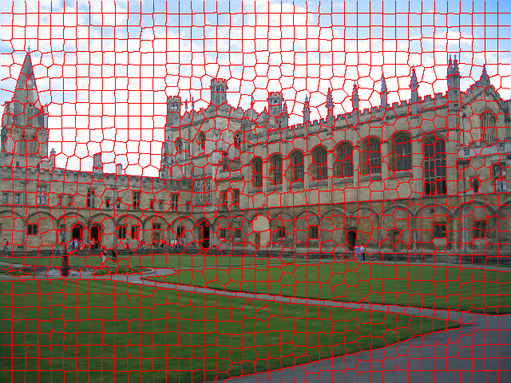

# gSLICr: SLIC superpixels at over 250Hz



This is the software bundle "gSLICr", a library for real-time superpixel segmentation written in C++ and CUDA. The current version is maintained by:

  [Carl Yuheng Ren](http://www.carlyuheng.com/) : <carl@robots.ox.ac.uk>  
  [Victor Adrian Prisacariu](http://www.robots.ox.ac.uk/~victor/) : <victor@robots.ox.ac.uk>  
  Ian D Reid : <ian.reid@adelaide.edu.au>  

For more information about gSLICr please visit the project website <http://www.robots.ox.ac.uk/~victor/gslicr>. 

Other related projects can be found in the Oxford Active Vision Library <http://www.oxvisionlib.org>.

# 1. Updates from gSLIC
- Works for any size / number of super pixels
- With GTX Titan X, 3.4ms@640x480, 12ms@1280x960, 20ms@1920x1080 image
- Multi-platform supported
  - Win8 Visual Studio
  - Ubuntu 14.04
  - Mac OSX 10.10

# 2. Building the System

### 2.1 Requirements

Several 3rd party libraries are needed for compiling gSLICr. The given version numbers are checked and working, but different versions might be fine as well. Some of the libraries are optional, and skipping them will reduce functionality.

  - cmake (e.g. version 2.8.10.2 or 3.2.3)  
    REQUIRED for Windows and Linux, unless you write your own build system  
    available at http://www.cmake.org/

  - CUDA (e.g. version 6.0 or 7.0)  
    REQUIRED for all GPU accelerated code  
    available at https://developer.nvidia.com/cuda-downloads

  - OpenCV (e.g. version 3.0)  
    REQUIRED if you want to run the demo, where it is used for reading camera input and displaying UI
    available at http://opencv.org/downloads.html

### 2.2 Build Process

  To compile the system, use the standard cmake approach:
```
  $ mkdir build
  $ cd build
  $ cmake /path/to/gSLICr
  $ make
```

  To run demo:
- plug in a webcam
- use the standard cmake approach:
```
mkdir build
cd build
cmake ../
make
./demo
```
- press `s` to save current segmentation result to current folder.

# 3. What to cite
If you use this code for your research, please kindly cite:
```
@article{gSLICr_2015,
	author = {{Ren}, C.~Y and {Prisacariu}, V.~A. and {Reid}, I.~D},
	title = "{gSLICr: SLIC superpixels at over 250Hz}",
	journal = {ArXiv e-prints},
	eprint = {1509.04232},
	year = 2015,
	month = sep
}
```
[arxiv linke](http://arxiv.org/abs/1509.04232)
